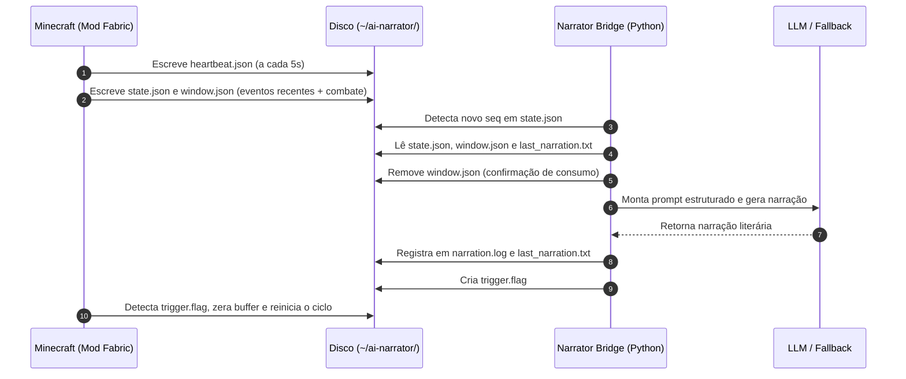

# 🎙️ NarratorJoe (AI Narrator)

[](https://www.minecraft.net/)
[](https://fabricmc.net/)
[](https://adoptium.net/)
[](https://www.python.org/)
[](LICENSE)
[]()

> **Narrador em tempo real alimentado por IA para Minecraft 1.21.1.**
> O mod Fabric observa suas ações no mundo (mineração, construção, exploração, combate, mortes e conquistas), enquanto um serviço Python inteligente gera narrações literárias dinâmicas no estilo de crônica ou romance picaresco.

---

## 📋 Índice

1. [Visão Geral e Arquitetura](#-visão-geral-e-arquitetura)
2. [Pré-requisitos](#-pré-requisitos)
3. [Guia Passo a Passo: Como Iniciar](#-guia-passo-a-passo-como-iniciar)
   - [Passo 1: Compilar e Instalar o Mod Fabric](#passo-1-compilar-e-instalar-o-mod-fabric)
   - [Passo 2: Configurar e Iniciar o Bridge Python](#passo-2-configurar-e-iniciar-o-bridge-python)
   - [Passo 3: Entrar no Jogo e Testar](#passo-3-entrar-no-jogo-e-testar)
4. [Como Funciona o Sistema (Sem API Key / Offline)](#-como-funciona-o-sistema-sem-api-key--offline)
5. [Comandos no Chat do Minecraft](#-comandos-no-chat-do-minecraft)
6. [Estrutura do Repositório](#-estrutura-do-repositório)
7. [Configurações Disponíveis](#-configurações-disponíveis)
8. [Solução de Problemas (Troubleshooting)](#-solução-de-problemas-troubleshooting)

---

## 🏗️ Visão Geral e Arquitetura

O sistema adota o padrão **Pipeline com IPC por Arquivos**. O Minecraft e o Bridge Python são processos totalmente desacoplados e operam através de arquivos compartilhados na pasta `~/ai-narrator/`:



---

## 💻 Pré-requisitos

Certifique-se de ter instalado em sua máquina:
1. **JDK 21** (Java Development Kit 21) — [Download Eclipse Temurin](https://adoptium.net/)
2. **Python 3.11 ou superior** — [Download Python](https://www.python.org/)
3. **Minecraft 1.21.1** com:
   - **Fabric Loader** (versão `>= 0.16.0`) instalado no seu inicializador (Launcher).
   - **Fabric API** para Minecraft 1.21.1 na pasta `.minecraft/mods/`.

---

## 🚀 Guia Passo a Passo: Como Iniciar

### Passo 1: Compilar e Instalar o Mod Fabric

1. Abra um terminal na pasta `mod/`:
   ```bash
   cd mod
   ```

2. Compile o mod usando o wrapper do Gradle:
   - **No Windows (PowerShell / CMD):**
     ```powershell
     .\gradlew.bat build
     ```
   - **No Linux / macOS:**
     ```bash
     ./gradlew build
     ```

3. O arquivo compilado estará em:
   ```
   mod/build/libs/ai-narrator-mod-0.1.0.jar
   ```

4. Copie esse arquivo `.jar` para a pasta `mods/` do seu Minecraft:
   - **Windows:** `%appdata%\.minecraft\mods\`
   - **Linux:** `~/.minecraft/mods/`
   - **macOS:** `~/Library/Application Support/minecraft/mods/`

---

### Passo 2: Configurar e Iniciar o Bridge Python

1. Abra um novo terminal na pasta `bridge/`:
   ```bash
   cd bridge
   ```

2. Crie e ative um ambiente virtual:
   - **No Windows (PowerShell):**
     ```powershell
     python -m venv .venv
     .venv\Scripts\Activate.ps1
     ```
   - **No Linux / macOS:**
     ```bash
     python3 -m venv .venv
     source .venv/bin/activate
     ```

3. Instale as dependências do bridge:
   ```bash
   pip install -e .
   ```

4. *(Opcional)* Configure seu provedor de LLM:
   - Se desejar usar **OpenAI**, **Anthropic** ou **Gemini**, copie `.env.example` para `.env`:
     ```bash
     cp .env.example .env
     ```
     Abra o arquivo `.env` e insira sua chave correspondente.
   - **Se você NÃO configurar nenhuma chave de API**, não se preocupe! O sistema entrará automaticamente em **Modo Fallback**, gerando narrações de alta qualidade via templates Jinja2.

5. Inicie o Narrator Bridge:
   ```bash
   narrator-bridge
   # ou: python -m narrator_bridge
   ```

   Você verá nos logs do terminal:
   ```
   [INFO] Bridge loop iniciado. Monitorando C:\Users\...\ai-narrator
   ```

---

### Passo 3: Entrar no Jogo e Testar

1. Abra o **Minecraft 1.21.1** com o perfil Fabric.
2. Crie um novo mundo Singleplayer (ou entre em um mundo existente).
3. No chat, você pode rodar o comando:
   ```mcfunction
   /narrator status
   ```
   O jogo exibirá o status do mod, a sequência atual (`seq`) e o caminho da pasta de dados.
4. Comece a jogar normalmente: quebre blocos, colete itens, lute com monstros, explore novos biomas!
5. A cada ciclo (60 segundos por padrão ou ao trocar de eventos significativos):
   - O mod gera os dados.
   - O Python processa e salva a narração.
   - Você pode acompanhar as narrações geradas em tempo real abrindo o arquivo:
     ```
     ~/ai-narrator/narration.log
     ```

---

## 🛡️ Como Funciona o Sistema (Sem API Key / Offline)

O projeto foi construído para ser **100% tolerante a falhas** e não travar por falta de saldo ou chave de API:
- **Fallback Inteligente (Jinja2):** Detecta a atividade dominante do jogador (Combate, Construção, Exploração ou Descanso) e renderiza frases contextualizadas em português brasileiro.
- **Ollama Local:** Você pode rodar modelos locais como `llama3`, `mistral` ou `qwen` totalmente grátis instalando o [Ollama](https://ollama.com/) e configurando `provider = "ollama"` em `narrator_config.toml`.
- **Anti-Repetição:** O sistema avalia similaridade Jaccard com a narração anterior para nunca soar repetitivo.

---

## 🎮 Comandos no Chat do Minecraft

Os seguintes comandos estão disponíveis para operadores (op level 2):

| Comando | Descrição |
|---|---|
| `/narrator status` | Exibe o status da gravação, sequência e caminho do bridge. |
| `/narrator pause` | Pausa a coleta de eventos temporariamente. |
| `/narrator resume` | Retoma a coleta de eventos normais. |
| `/narrator reload` | Recarrega as opções de `.minecraft/config/ai-narrator.json`. |

---

## 📂 Estrutura do Repositório

```
ai-narrator/
├── mod/                  # Código-fonte Java 21 do Mod Fabric
│   ├── src/main/java/    # Coletores, Mixins, StateBuilder, WindowBuilder
│   └── build.gradle      # Configurações do Fabric Loom
├── bridge/               # Serviço Python do Narrator
│   ├── narrator_bridge/  # Loop principal, Schemas, PromptBuilder, Fallback
│   ├── tests/            # Testes automatizados (pytest)
│   ├── narrator_config.toml # Configurações de estilo, intervalo e modelo
│   └── pyproject.toml    # Dependências e empacotamento
├── docs/                 # Especificações técnicas e arquiteturais completas
│   ├── ARCHITECTURE.md   # Detalhes de IPC e concorrência
│   ├── SCHEMA.md         # Formato JSON de state, window e logs
│   ├── MOD_SPEC.md       # Especificação do mod Fabric
│   ├── PYTHON_BRIDGE_SPEC.md # Especificação técnica do bridge
│   ├── PROMPT_ENGINEERING.md # Persona e diretrizes dos prompts
│   └── CHECKLIST.md      # Critérios de validação e aceitação
├── .gitignore
└── README.md
```

---

## ⚙️ Configurações Disponíveis

### `narrator_config.toml` (no Bridge)
- `style`: Estilo da persona (`storyteller` [padrão], `documentary`, `playful`, `epic`).
- `cycle_interval_s`: Tempo padrão da janela de narração (padrão: `60` segundos).
- `max_chars`: Tamanho máximo das frases de narração (padrão: `400` caracteres).
- `provider`: Provedor ativo (`openai`, `anthropic`, `gemini`, `ollama`, `mock`).

### `.minecraft/config/ai-narrator.json` (no Mod)
- `bridge_path`: Pasta onde os arquivos IPC são trocados (padrão: `~/ai-narrator`).
- `heartbeat_interval_ms`: Intervalo de batimento cardíaco (padrão: `5000`ms).
- `trigger_poll_ms`: Frequência de leitura de flags (padrão: `1000`ms).

---

## 🛠️ Solução de Problemas (Troubleshooting)

- **O mod e o Python não estão se comunicando:**
  - Verifique se o caminho `bridge_path` em `config/ai-narrator.json` é o mesmo que `bridge.path` em `narrator_config.toml`. Ambos expandem `~` para a pasta do seu usuário.
- **"Mod inativo há Xs, aguardando heartbeat":**
  - O Minecraft ainda não está com um mundo carregado ou o mod não foi colocado na pasta `mods/`. Assim que você entrar no mundo, o heartbeat é gerado automaticamente.
- **Executar os testes automatizados:**
  - No terminal da pasta `bridge/`, execute `pytest` com o ambiente virtual ativado para validar que todos os 13 testes unitários estão passando.